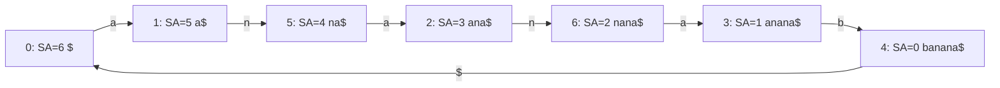
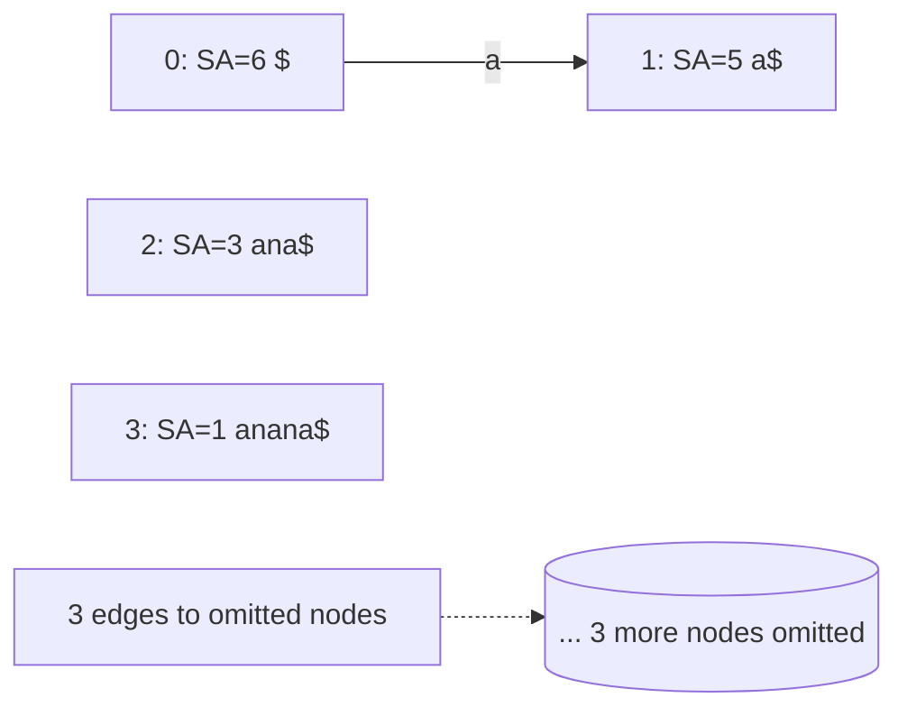

# Wheeler Graph Mermaid Examples

このファイルは、`textindex graph` が出力する Wheeler graph の Mermaid 例です。

## 例1: `banana` 全ノード表示

入力テキスト:

```text
banana
```

生成コマンド:

```bash
printf 'banana' > /tmp/wheeler_sample.txt
./textindex build /tmp/wheeler_sample.txt /tmp/wheeler_sample.idx
./textindex graph --max-nodes 0 /tmp/wheeler_sample.idx
```

出力例:



## 例2: ノード制限あり（`--max-nodes 4`）

生成コマンド:

```bash
./textindex graph --max-nodes 4 /tmp/wheeler_sample.idx
```

出力例:


